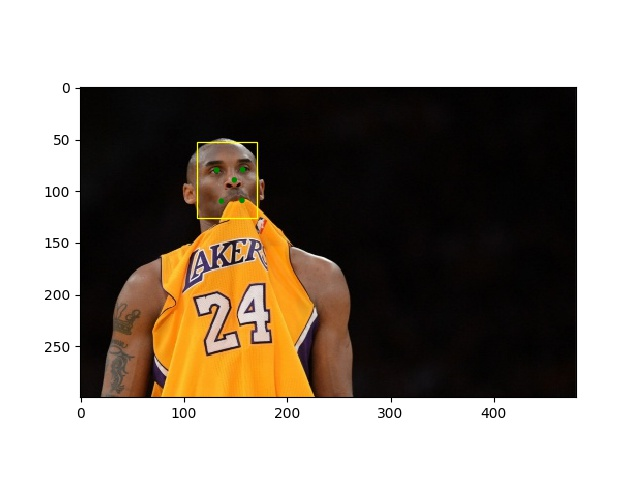
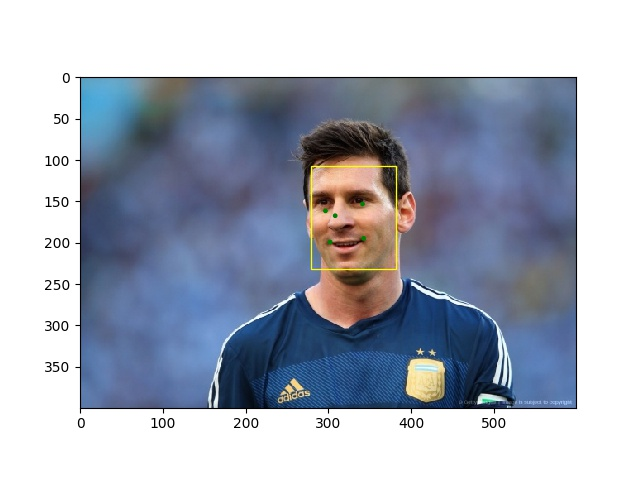

# mtcnn-pytorch
  https://blog.csdn.net/On_theway10/article/details/102628169

# results:
<table style="border:0px">
   <tr>
       <td></td>
       <td></td>
</table>

# Test an image
  * run > python demo.py

# Training data prepraring
  * download [WIDER FACE](https://pan.baidu.com/s/1sJTO7TcQ2576RUqR_IIhbQ) (passcode:lsl3) face detection data then store it into ./data_set/face_detection
    * run > python ./anno_store/tool/format/transform.py change .mat(wider_face_train.mat) into .txt(anno_train.txt)
  * download [CNN_FacePoint](http://mmlab.ie.cuhk.edu.hk/archive/CNN_FacePoint.htm) face detection and landmark data then store it into ./data_set/face_landmark

# Training
  * preparing data for P-Net
    * run > python detlib/preprocess/gen_Pnet_train_data.py
    * run > python detlib/preprocess/gen_landmark.py  # modify the img_size = 12
    * run > python detlib/preprocess/assemble_pnet_imglist.py
  * train P-Net
    * run > python detlib/train_net/train_p_net.py

  * preparing data for R-Net
    * run > python detlib/preprocess/gen_Rnet_train_data.py (maybe you should change the pnet model path)
    * run > python detlib/preprocess/gen_landmark.py  # modify the img_size = 24
    * run > python detlib/preprocess/assemble_rnet_imglist.py
  * train R-Net
    * run > python detlib/train_net/train_r_net.py

  * preparing data for O-Net
    * run > python detlib/preprocess/gen_Onet_train_data.py
    * run > python detlib/preprocess/gen_landmark.py  # modify the img_size = 48
    * run > python detlib/preprocess/assemble_onet_imglist.py
  * train O-Net
    * run > python detlib/train_net/train_o_net.py
